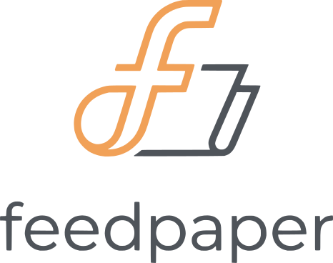

  

Turn your unread **Feedbin** blog posts into a single **ePub newspaper** for your
e-reader, so you read your blogs on e-ink instead of a screen.

## 🌱 Tutorials
>
> Start here as a new user

- [Install feedpaper](/docs/tutorial/install-feedpaper.md)
- [Build your first newspaper](/docs/tutorial/build-your-first-newspaper.md)

## 🔧 How-to
>
> Practical step-by-step guides for the more experienced user

- [Install feedpaper manually](/docs/how-to/install-feedpaper-manually.md)
- [Uninstall feedpaper](/docs/how-to/uninstall-feedpaper.md)
- [Build a standalone binary](/docs/how-to/build-a-binary.md)
- [Release a new version](/docs/how-to/release-a-new-version.md)

## 🔍 Reference
>
> Technical reference material

- [Command-line interface](/docs/reference/cli.md)
- [Configuration files](/docs/reference/configuration.md)

## 💡 Explanation
>
> Explanation and analysis of some key concepts

- [Content strategy: inline content vs. full-text extraction](/docs/explanation/content-strategy.md)
- [Why excluding blogs helps](/docs/explanation/why-exclude-blogs.md)
